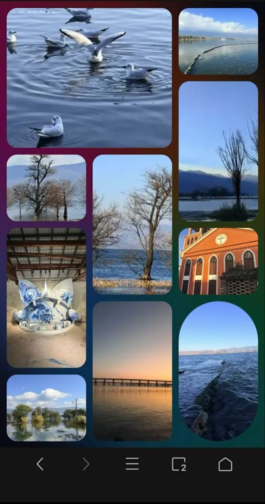
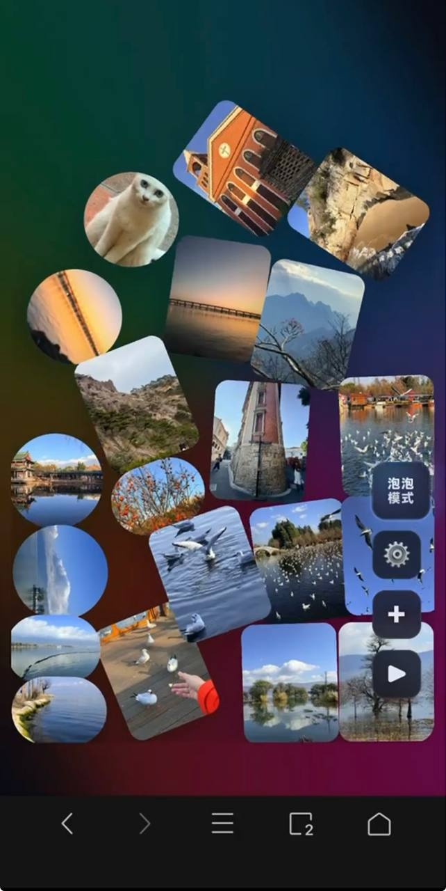
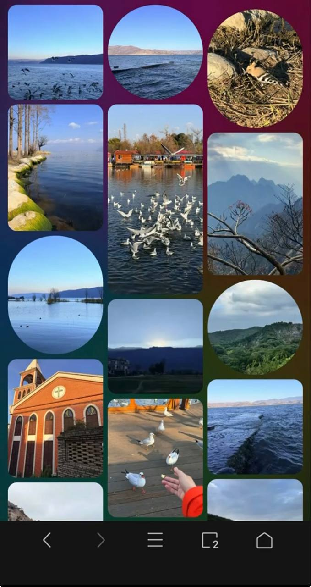

# Image Gallery（本地图片画廊 / PWA）

一个自托管的本地图片画廊：支持 **泡泡下雨效果**、**拼贴轮播墙**、**瀑布流**。手机端可 **PWA 添加到主屏幕**，并支持大图浏览、缩放、上传/删除（可选 token）。

## 功能亮点

## 界面预览

| 拼贴模式 | 泡泡模式 | 圆形/椭圆效果 |
|---|---|---|
|  |  |  |

- 三种浏览模式
  - **泡泡模式**：图片像“下雨”从上往下落；新图尽量在上方，旧图优先从底部替换
  - **拼贴模式**：固定模板拼图墙，格子随机轮播切换，过渡更柔和
  - **瀑布流模式**：支持列数配置；支持随机顺序展示（每次进入不固定）
- 大图浏览（Lightbox）
  - `contain` 不裁切 + **模糊背景填充**（避免黑边）
  - 支持 **滚轮缩放 / 双击缩放 / 拖拽平移**
  - 支持 **左右滑动切换**，并减少 iOS 边缘返回误触
- PWA
  - 支持“添加到主屏幕”后全屏体验（减少地址栏/底栏影响）
- 性能
  - 缩略图由 `sharp` 生成并缓存到磁盘 `.thumbs`
  - 可选 Redis 缓存：目录列表 & EXIF 元数据（不缓存图片二进制）

---

## 快速开始

### 本地运行

```bash
npm install
PORT=8088 IMAGES_DIR=/path/to/your/images npm start
```

打开：
- http://localhost:8088/

> `IMAGES_DIR` 是图片目录，支持子目录结构（例如 `2026/01`）。

---

## 环境变量

| 变量 | 说明 | 默认 |
|---|---|---|
| `PORT` | 服务端口 | `3000` |
| `IMAGES_DIR` | 图片目录（必填） | `/images` |
| `THUMB_WIDTH` | 缩略图宽度（可选） | （见代码默认） |
| `THUMB_QUALITY` | 缩略图质量（可选） | （见代码默认） |
| `UPLOAD_TOKEN` | 上传/删除鉴权 token（可选） | 空（不安全） |
| `REDIS_URL` | Redis 连接串（可选，用于元数据缓存） | 空 |

示例：

```bash
PORT=8088 \
IMAGES_DIR=/data/photos \
UPLOAD_TOKEN=your_token \
REDIS_URL=redis://127.0.0.1:6379 \
npm start
```

---

## 使用说明

- 右下角 **“xxx\n模式”按钮**：快速切换「泡泡 / 拼贴 / 瀑布流」
- ⚙️ 设置：列数、泡泡数量、信息显示、删除模式等
- PWA（iPhone）：Safari → 分享 → 添加到主屏幕

---

## 安全提示（重要）

如果部署到公网，强烈建议：

1) 设置 `UPLOAD_TOKEN`（否则任何人都可能上传/删除）
2) 通过反向代理做访问控制（Basic Auth / IP 白名单 / VPN）

---

## 目录结构

```text
.
  server.js
  public/
    index.html
    manifest.webmanifest
    sw.js
    icons/
    assets/
      app.js
      styles.css
  images/         # 示例目录（实际由 IMAGES_DIR 指定）
```

---

## License

MIT（如需改协议可自行调整）
